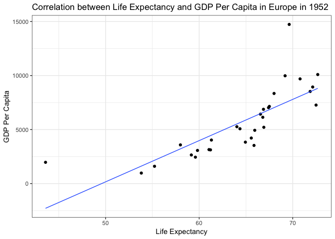
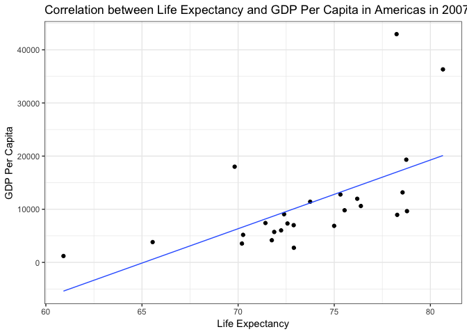
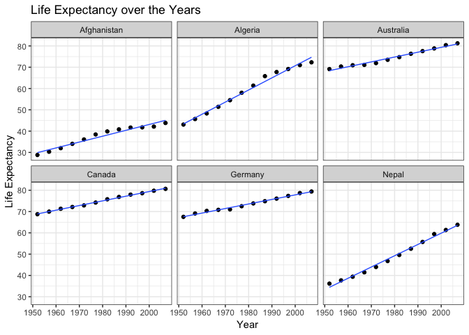
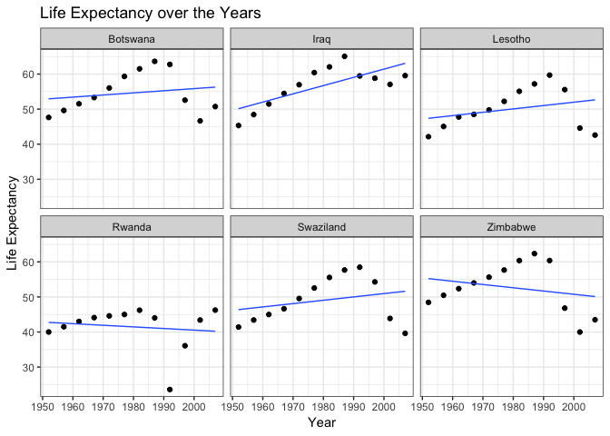
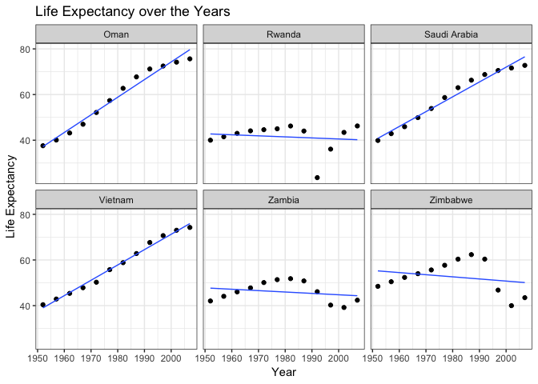

HW06-Data wrangling wrap up
================
Frederike Basedow
9 November 2018

Homework 06: Data wrangling wrap up
===================================

### Load packages

``` r
library(tidyverse)
library(gapminder)
library(knitr)
library(broom)
library(stringr)
library(singer)
library(ggmap)
```

### Writing functions

Let's make a function that fits a linear model between `pop` and `gdpPercap for a specific continent in a specific year and extract info on the model with the`glance`function from the`broom\` package:

``` r
lm_lE_gdp <- function(cont, yr) {
  gap_select <- gapminder %>% filter(continent == cont, year == yr) # filter continent and year of choice
  lm(lifeExp ~ gdpPercap, data = gap_select) %>% #fit linear model
  glance() #extract info about model
}
```

Let's see if it works for Europe in 1952:

``` r
lm_lE_gdp("Europe", "1952")
```

    ##   r.squared adj.r.squared    sigma statistic      p.value df    logLik
    ## 1 0.6084326     0.5944481 4.050929  43.50749 3.739183e-07  2 -83.50165
    ##        AIC      BIC deviance df.residual
    ## 1 173.0033 177.2069 459.4808          28

Looking at the r squared value, we can tell that the fit is not amazing, i.e. the fitted values are not super close to the orignal values. However, the p-value is very low and considering an alpha of 0.05, the model is significant, i.e. there is a relationship between life expectancy and GDP per capita.

Let's also make a function for plotting it:

``` r
# make function to plot data from different continents and years
plot_lE_gdp_lm <- function(cont, yr){
  gapminder %>% 
  filter(continent == cont, year == yr) %>% 
  ggplot(aes(lifeExp, gdpPercap))+
  geom_point() +
  geom_smooth(method =lm, se=FALSE, size = 0.5) +
  labs(title = str_c("Correlation between Life Expectancy and GDP Per Capita in ", cont, " in ", yr), x= "Life Expectancy", y = "GDP Per Capita")+
  theme_bw()
}

# plot lifeExp vs. gdpPercap in Europe in 1952
plot_lE_gdp_lm("Europe", "1952")
```



Now we can easily fit a linear model for another continent in a different year. How about the Americas in 2007?

``` r
# fit linear model for lifeExp vs. gdpPercap for the Americas in 2007
lm_lE_gdp("Americas", "2007")
```

    ##   r.squared adj.r.squared    sigma statistic     p.value df    logLik
    ## 1  0.349241     0.3209471 3.659548  12.34334 0.001866495  2 -66.86468
    ##        AIC     BIC deviance df.residual
    ## 1 139.7294 143.386 308.0227          23

The fit is worse than for Europe in 1952, but the correlation is still significant. Let's have a look at it:

``` r
# plot lifeExp vs. gdpPercap for the Americas in 2007
plot_lE_gdp_lm("Americas", "2007")
```



Yeah, looks like the residuals are bigger here than for Europe in 1952, but life expectancy seems to increase with time.

### 4. Work with the `singer` data

I originally wanted to do this tasks but I wasn't able to get any locations. I am guessing that is because I exceeded the max of 2500 queries a day since I didn't try on a smaller subset of data first (the data contains more than 2500 locations). I would still be interested to know if the code is correct. :)

``` r
# have a look at data set
kable(head(singer_locations, 3))
```

| track\_id          | title                 | song\_id           | release             | artist\_id         | artist\_name           |  year|  duration|  artist\_hotttnesss|  artist\_familiarity|  latitude|  longitude| name          | city         |
|:-------------------|:----------------------|:-------------------|:--------------------|:-------------------|:-----------------------|-----:|---------:|-------------------:|--------------------:|---------:|----------:|:--------------|:-------------|
| TRWICRA128F42368DB | The Conversation (Cd) | SOSURTI12A81C22FB8 | Even If It Kills Me | ARACDPV1187FB58DF4 | Motion City Soundtrack |  2007|  170.4485|           0.6410183|            0.8230522|        NA|         NA| NA            | NA           |
| TRXJANY128F42246FC | Lonely Island         | SODESQP12A6D4F98EF | The Duke Of Earl    | ARYBUAO1187FB3F4EB | Gene Chandler          |  2004|  106.5530|           0.3937627|            0.5700167|  41.88415|  -87.63241| Gene Chandler | Chicago, IL  |
| TRIKPCA128F424A553 | Here's That Rainy Day | SOQUYQD12A8C131619 | Imprompture         | AR4111G1187B9B58AB | Paul Horn              |  1998|  527.5947|           0.4306226|            0.5039940|  40.71455|  -74.00712| Paul Horn     | New York, NY |

First, I will make a tibble that includes the artist, the city and the longitude and latitude:

``` r
# select artist_name, latitude, longitude, and city
artist_location <- singer_locations %>% select(artist_name, latitude, longitude, city)

# check it out
kable(head(artist_location))
```

| artist\_name                   |  latitude|  longitude| city         |
|:-------------------------------|---------:|----------:|:-------------|
| Motion City Soundtrack         |        NA|         NA| NA           |
| Gene Chandler                  |  41.88415|  -87.63241| Chicago, IL  |
| Paul Horn                      |  40.71455|  -74.00712| New York, NY |
| Ronnie Earl & the Broadcasters |        NA|         NA| NA           |
| Dorothy Ashby                  |  42.33168|  -83.04792| Detroit, MI  |
| Barleyjuice                    |  40.99471|  -77.60454| Pennsylvania |

Let's get rid of all the artist of which there is no location noted:

``` r
# drop NAs
artist_location <- artist_location %>% drop_na

# print new tibble without NAs
kable(head(artist_location))
```

| artist\_name                                |  latitude|   longitude| city         |
|:--------------------------------------------|---------:|-----------:|:-------------|
| Gene Chandler                               |  41.88415|   -87.63241| Chicago, IL  |
| Paul Horn                                   |  40.71455|   -74.00712| New York, NY |
| Dorothy Ashby                               |  42.33168|   -83.04792| Detroit, MI  |
| Barleyjuice                                 |  40.99471|   -77.60454| Pennsylvania |
| Madlib                                      |  34.20034|  -119.18044| Oxnard, CA   |
| Seeed's Pharaoh Riddim Feat. General Degree |  50.73230|     7.10169| Bonn         |

And now let's see if we can retrieve the location info from the longitude and latitude for each artist:

``` r
# make function to use revgeocode with two separate inputs
get_location <- function(x, y) revgeocode(c(x,y), output = "address")

#map2(artist_location$longitude, artist_location$latitude, get_location) 
```

This is where I failed to get the locations, so I didn't continue on this task.

### 6. Work with a nested data frame

I will first follow the [split-apply-combine lesson from Jenny Bryan](http://stat545.com/block024_group-nest-split-map.html) to nest `gapminder` data per country:

``` r
# nest gapminder data for each country
gap_nested <- gapminder %>% 
  group_by(continent, country) %>% 
  nest()

head(gap_nested)
```

    ## # A tibble: 6 x 3
    ##   continent country     data             
    ##   <fct>     <fct>       <list>           
    ## 1 Asia      Afghanistan <tibble [12 × 4]>
    ## 2 Europe    Albania     <tibble [12 × 4]>
    ## 3 Africa    Algeria     <tibble [12 × 4]>
    ## 4 Africa    Angola      <tibble [12 × 4]>
    ## 5 Americas  Argentina   <tibble [12 × 4]>
    ## 6 Oceania   Australia   <tibble [12 × 4]>

Now our data consists of one row for each country with a nested list for each country in the data column that contains all of the other data for this country. Let's have a look at what is in this list for the first country (Afghanistan):

``` r
# have a look at contents in data list of first country
kable(gap_nested$data[[1]], format = "html", caption = gap_nested$country[1])
```

<table>
<caption>
Afghanistan
</caption>
<thead>
<tr>
<th style="text-align:right;">
year
</th>
<th style="text-align:right;">
lifeExp
</th>
<th style="text-align:right;">
pop
</th>
<th style="text-align:right;">
gdpPercap
</th>
</tr>
</thead>
<tbody>
<tr>
<td style="text-align:right;">
1952
</td>
<td style="text-align:right;">
28.801
</td>
<td style="text-align:right;">
8425333
</td>
<td style="text-align:right;">
779.4453
</td>
</tr>
<tr>
<td style="text-align:right;">
1957
</td>
<td style="text-align:right;">
30.332
</td>
<td style="text-align:right;">
9240934
</td>
<td style="text-align:right;">
820.8530
</td>
</tr>
<tr>
<td style="text-align:right;">
1962
</td>
<td style="text-align:right;">
31.997
</td>
<td style="text-align:right;">
10267083
</td>
<td style="text-align:right;">
853.1007
</td>
</tr>
<tr>
<td style="text-align:right;">
1967
</td>
<td style="text-align:right;">
34.020
</td>
<td style="text-align:right;">
11537966
</td>
<td style="text-align:right;">
836.1971
</td>
</tr>
<tr>
<td style="text-align:right;">
1972
</td>
<td style="text-align:right;">
36.088
</td>
<td style="text-align:right;">
13079460
</td>
<td style="text-align:right;">
739.9811
</td>
</tr>
<tr>
<td style="text-align:right;">
1977
</td>
<td style="text-align:right;">
38.438
</td>
<td style="text-align:right;">
14880372
</td>
<td style="text-align:right;">
786.1134
</td>
</tr>
<tr>
<td style="text-align:right;">
1982
</td>
<td style="text-align:right;">
39.854
</td>
<td style="text-align:right;">
12881816
</td>
<td style="text-align:right;">
978.0114
</td>
</tr>
<tr>
<td style="text-align:right;">
1987
</td>
<td style="text-align:right;">
40.822
</td>
<td style="text-align:right;">
13867957
</td>
<td style="text-align:right;">
852.3959
</td>
</tr>
<tr>
<td style="text-align:right;">
1992
</td>
<td style="text-align:right;">
41.674
</td>
<td style="text-align:right;">
16317921
</td>
<td style="text-align:right;">
649.3414
</td>
</tr>
<tr>
<td style="text-align:right;">
1997
</td>
<td style="text-align:right;">
41.763
</td>
<td style="text-align:right;">
22227415
</td>
<td style="text-align:right;">
635.3414
</td>
</tr>
<tr>
<td style="text-align:right;">
2002
</td>
<td style="text-align:right;">
42.129
</td>
<td style="text-align:right;">
25268405
</td>
<td style="text-align:right;">
726.7341
</td>
</tr>
<tr>
<td style="text-align:right;">
2007
</td>
<td style="text-align:right;">
43.828
</td>
<td style="text-align:right;">
31889923
</td>
<td style="text-align:right;">
974.5803
</td>
</tr>
</tbody>
</table>
We can see that the list in the data column contains the year, life expectancy, population and GDP per capita information. This is the case for each country in the `gap_nested$data` column.

Before fitting a model, let's quickly plot life expectancy over the years for a few random countries to get a feel for how the data looks like:

``` r
# make a function for plotting this:
plot_lEY <- function(data, selection) {
data %>% 
  filter(country %in% selection) %>% 
  ggplot(aes(year, lifeExp), size = 0.5) +
  geom_point() +
  geom_smooth(method = lm, size = 0.5, se = FALSE) +
  facet_wrap(~country) +
    theme_bw() +
    labs(title = "Life Expectancy over the Years", x = "Year", y = "Life Expectancy") 
}

# select some randomly chosen countries
country_selection <- c("Afghanistan", "Germany", "Canada", "Nepal", "Algeria", "Australia")

# plot lifeExp over the years for these countries
plot_lEY(gapminder, country_selection)
```



Cool, life expectancy seems to be linearly increasing over the years for all of these random countries. Let's fit a linear model to see how it looks for all countries. Using the nested data frame `gap_nested` and the `map` function allows us to do that for all countries at the same time.

Reading through [this file from the STAT545 website](http://stat545.com/block012_function-regress-lifeexp-on-year.html), I learned that we need to specify the Intercept as the first year in the `gapminder` data, i.e. 1952. I will make use of this info in my linear model.

Let's first make a function to fit the linear model that we can then use in `map` to apply it to all of our nested data.

``` r
# make function that fits a linear model to life expectancy and year of a data set
fit_lEY <- function(data) lm(lifeExp ~ I(year - 1952), data = data)
```

We can easily use this function to fit a linear model for one country (e.g. Afghanistan) in our data:

``` r
# fitting our linear model for the first country in our data, i.e. Afghanistan
fit_lEY(gap_nested$data[[1]]) 
```

    ## 
    ## Call:
    ## lm(formula = lifeExp ~ I(year - 1952), data = data)
    ## 
    ## Coefficients:
    ##    (Intercept)  I(year - 1952)  
    ##        29.9073          0.2753

To fit it to all countries at the same time we can use the `map` function. I will store the output in a new variable `fit` that contains a list for each country with the linear model output using the `mutate` function. .

``` r
 # fitting my linear model function to the data contained in each nested list in the data column of gap_nested
gap_nested_fit <- gap_nested %>% 
  mutate(fit = map(data, fit_lEY))

head(gap_nested_fit)
```

    ## # A tibble: 6 x 4
    ##   continent country     data              fit     
    ##   <fct>     <fct>       <list>            <list>  
    ## 1 Asia      Afghanistan <tibble [12 × 4]> <S3: lm>
    ## 2 Europe    Albania     <tibble [12 × 4]> <S3: lm>
    ## 3 Africa    Algeria     <tibble [12 × 4]> <S3: lm>
    ## 4 Africa    Angola      <tibble [12 × 4]> <S3: lm>
    ## 5 Americas  Argentina   <tibble [12 × 4]> <S3: lm>
    ## 6 Oceania   Australia   <tibble [12 × 4]> <S3: lm>

Great, now we have a new column that includes info on the linear model. Let's have a looks at what's in there for the first 2 countries:

``` r
# subset the info in the fit column for the first two countries
gap_nested_fit$fit[1:2]
```

    ## [[1]]
    ## 
    ## Call:
    ## lm(formula = lifeExp ~ I(year - 1952), data = data)
    ## 
    ## Coefficients:
    ##    (Intercept)  I(year - 1952)  
    ##        29.9073          0.2753  
    ## 
    ## 
    ## [[2]]
    ## 
    ## Call:
    ## lm(formula = lifeExp ~ I(year - 1952), data = data)
    ## 
    ## Coefficients:
    ##    (Intercept)  I(year - 1952)  
    ##        59.2291          0.3347

So we have the results from the linear model in each of these nested lists per country. We can extract more information about these results using the `broom` package. The `tidy` function from this package will give us the different parameters from a model nicely organized in a table. Here is how that looks for the first country, i.e. Afghanistan:

``` r
# make function that applies broom function to the Afghanistan fit data and presents it in a kable
broom_apply_Afgh <- function(x) kable(x(gap_nested_fit$fit[[1]]))

# apply broom::tidy to linear model output data from Afghanistan
broom_apply_Afgh(tidy)
```

| term           |    estimate|  std.error|  statistic|  p.value|
|:---------------|-----------:|----------:|----------:|--------:|
| (Intercept)    |  29.9072949|  0.6639995|   45.04114|    0e+00|
| I(year - 1952) |   0.2753287|  0.0204509|   13.46289|    1e-07|

We can also look at fitted values and residuals for Afghanistan with the `augment` function from the `broom` package:

``` r
# apply broom::augment to linear model output data from Afghanistan
broom_apply_Afgh(augment)
```

|  lifeExp|  I.year...1952.|   .fitted|    .se.fit|      .resid|       .hat|    .sigma|    .cooksd|  .std.resid|
|--------:|---------------:|---------:|----------:|-----------:|----------:|---------:|----------:|-----------:|
|   28.801|               0|  29.90729|  0.6639995|  -1.1062949|  0.2948718|  1.211813|  0.2427205|  -1.0774216|
|   30.332|               5|  31.28394|  0.5799442|  -0.9519382|  0.2249417|  1.237512|  0.1134714|  -0.8842813|
|   31.997|              10|  32.66058|  0.5026799|  -0.6635816|  0.1689977|  1.265886|  0.0360357|  -0.5953084|
|   34.020|              15|  34.03722|  0.4358337|  -0.0172249|  0.1270396|  1.288917|  0.0000165|  -0.0150768|
|   36.088|              20|  35.41387|  0.3848726|   0.6741317|  0.0990676|  1.267003|  0.0185483|   0.5808279|
|   38.438|              25|  36.79051|  0.3566719|   1.6474883|  0.0850816|  1.154002|  0.0922536|   1.4085751|
|   39.854|              30|  38.16716|  0.3566719|   1.6868450|  0.0850816|  1.147076|  0.0967139|   1.4422244|
|   40.822|              35|  39.54380|  0.3848726|   1.2782016|  0.0990676|  1.208243|  0.0666828|   1.1012910|
|   41.674|              40|  40.92044|  0.4358337|   0.7535583|  0.1270396|  1.260583|  0.0316557|   0.6595814|
|   41.763|              45|  42.29709|  0.5026799|  -0.5340851|  0.1689977|  1.274051|  0.0233434|  -0.4791353|
|   42.129|              50|  43.67373|  0.5799442|  -1.5447284|  0.2249417|  1.148593|  0.2987950|  -1.4349402|
|   43.828|              55|  45.05037|  0.6639995|  -1.2223718|  0.2948718|  1.194109|  0.2963271|  -1.1904691|

And the `glance` function gives us a nice one-row summary. Here for Afghanistan:

``` r
# apply broom::glance to linear model output data from Afghanistan
broom_apply_Afgh(glance)
```

|  r.squared|  adj.r.squared|     sigma|  statistic|  p.value|   df|     logLik|       AIC|       BIC|  deviance|  df.residual|
|----------:|--------------:|---------:|----------:|--------:|----:|----------:|---------:|---------:|---------:|------------:|
|  0.9477123|      0.9424835|  1.222788|   181.2494|    1e-07|    2|  -18.34693|  42.69387|  44.14859|   14.9521|           10|

We can get this info for all countries at the same time using the `map` function again, creating a new variable again that contains a list for each country containing this data. Let's add the output of each of the 3 `broom` functions to each country as a separate list, in a new column each:

``` r
# fit tidy, augment, and glance to data in the fit column and add the output as new nested lists for each country to our tibble
gap_nested_fit_data <- gap_nested_fit %>% 
  mutate(tidy = map(fit, tidy),
         augment = map(fit, augment),
         glance = map(fit, glance))

head(gap_nested_fit_data)
```

    ## # A tibble: 6 x 7
    ##   continent country     data              fit      tidy    augment glance 
    ##   <fct>     <fct>       <list>            <list>   <list>  <list>  <list> 
    ## 1 Asia      Afghanistan <tibble [12 × 4]> <S3: lm> <data.… <data.… <data.…
    ## 2 Europe    Albania     <tibble [12 × 4]> <S3: lm> <data.… <data.… <data.…
    ## 3 Africa    Algeria     <tibble [12 × 4]> <S3: lm> <data.… <data.… <data.…
    ## 4 Africa    Angola      <tibble [12 × 4]> <S3: lm> <data.… <data.… <data.…
    ## 5 Americas  Argentina   <tibble [12 × 4]> <S3: lm> <data.… <data.… <data.…
    ## 6 Oceania   Australia   <tibble [12 × 4]> <S3: lm> <data.… <data.… <data.…

Let's unnest these to create 3 different tibbles, one for each `broom` function output, so that we have this output for each country and can make use of it for further analysis.

Let's create a function for that:

``` r
# make function that unnests data of a specific column in our gap_nested_fit_data
gap_fit_unnest <- function(x) {
  gap_nested_fit_data %>% 
  select(continent, country, x) %>% 
  unnest()
}
```

First for the `tidy` output:

``` r
# unnest data from tidy list
lEY_fit_tidy <- gap_fit_unnest("tidy") 

kable(head(lEY_fit_tidy))
```

| continent | country     | term           |    estimate|  std.error|  statistic|  p.value|
|:----------|:------------|:---------------|-----------:|----------:|----------:|--------:|
| Asia      | Afghanistan | (Intercept)    |  29.9072949|  0.6639995|   45.04114|  0.0e+00|
| Asia      | Afghanistan | I(year - 1952) |   0.2753287|  0.0204509|   13.46289|  1.0e-07|
| Europe    | Albania     | (Intercept)    |  59.2291282|  1.0768440|   55.00251|  0.0e+00|
| Europe    | Albania     | I(year - 1952) |   0.3346832|  0.0331664|   10.09104|  1.5e-06|
| Africa    | Algeria     | (Intercept)    |  43.3749744|  0.7184202|   60.37549|  0.0e+00|
| Africa    | Algeria     | I(year - 1952) |   0.5692797|  0.0221271|   25.72775|  0.0e+00|

Next, unnest the `augment` output:

``` r
# unnest data from augment list
lEY_fit_augment <- gap_fit_unnest("augment") 

kable(head(lEY_fit_augment))
```

| continent | country     |  lifeExp|  I.year...1952.|   .fitted|    .se.fit|      .resid|       .hat|    .sigma|    .cooksd|  .std.resid|
|:----------|:------------|--------:|---------------:|---------:|----------:|-----------:|----------:|---------:|----------:|-----------:|
| Asia      | Afghanistan |   28.801|               0|  29.90729|  0.6639995|  -1.1062949|  0.2948718|  1.211813|  0.2427205|  -1.0774216|
| Asia      | Afghanistan |   30.332|               5|  31.28394|  0.5799442|  -0.9519382|  0.2249417|  1.237512|  0.1134714|  -0.8842813|
| Asia      | Afghanistan |   31.997|              10|  32.66058|  0.5026799|  -0.6635816|  0.1689977|  1.265886|  0.0360357|  -0.5953084|
| Asia      | Afghanistan |   34.020|              15|  34.03722|  0.4358337|  -0.0172249|  0.1270396|  1.288917|  0.0000165|  -0.0150768|
| Asia      | Afghanistan |   36.088|              20|  35.41387|  0.3848726|   0.6741317|  0.0990676|  1.267003|  0.0185483|   0.5808279|
| Asia      | Afghanistan |   38.438|              25|  36.79051|  0.3566719|   1.6474883|  0.0850816|  1.154002|  0.0922536|   1.4085751|

And lastly for the `glance` data:

``` r
# unnest data from glance list
lEY_fit_glance <- gap_fit_unnest("glance") 

kable(head(lEY_fit_glance))
```

| continent | country     |  r.squared|  adj.r.squared|      sigma|   statistic|  p.value|   df|      logLik|        AIC|        BIC|    deviance|  df.residual|
|:----------|:------------|----------:|--------------:|----------:|-----------:|--------:|----:|-----------:|----------:|----------:|-----------:|------------:|
| Asia      | Afghanistan |  0.9477123|      0.9424835|  1.2227880|   181.24941|  1.0e-07|    2|  -18.346935|  42.693870|  44.148590|  14.9521045|           10|
| Europe    | Albania     |  0.9105778|      0.9016355|  1.9830615|   101.82901|  1.5e-06|    2|  -24.149036|  54.298071|  55.752791|  39.3253302|           10|
| Africa    | Algeria     |  0.9851172|      0.9836289|  1.3230064|   661.91709|  0.0e+00|    2|  -19.292214|  44.584427|  46.039147|  17.5034589|           10|
| Africa    | Angola      |  0.8878146|      0.8765961|  1.4070091|    79.13818|  4.6e-06|    2|  -20.030928|  46.061857|  47.516577|  19.7967471|           10|
| Americas  | Argentina   |  0.9955681|      0.9951249|  0.2923072|  2246.36635|  0.0e+00|    2|   -1.173933|   8.347866|   9.802586|   0.8544349|           10|
| Oceania   | Australia   |  0.9796477|      0.9776125|  0.6206086|   481.34586|  0.0e+00|    2|  -10.208677|  26.417353|  27.872073|   3.8515501|           10|

Great, now we have 3 different tibbles with information from the linear model for every country.

Let's see if we can find the countries with the highest residuals:

``` r
# extracting the max residual for each country
lEY_max_res <- lEY_fit_augment %>% 
  group_by(country) %>% 
  summarize(max_res = max(.resid)) %>% 
  arrange(desc(max_res)) 

kable(head(lEY_max_res))
```

| country   |   max\_res|
|:----------|----------:|
| Zimbabwe  |  10.385491|
| Botswana  |   8.569486|
| Lesotho   |   8.483345|
| Swaziland |   8.283148|
| Iraq      |   6.698171|
| Rwanda    |   6.020782|

Cool, let's plot the 6 countries with the highest residuals:

``` r
# reorder levels by descending max residual
lEY_max_res <- lEY_max_res %>%
  mutate(country = fct_reorder(country, max_res, desc))

# extract 6 countries with highest residuals
lEY_max_res_countries <- levels(lEY_max_res$country)[1:6]

# plot estimated and real life expectancy for these countries
plot_lEY(gapminder, lEY_max_res_countries)
```



We can see that the linear model is not a great fit in these countries.

We can also use the rsquared value from the `glance` data to find the countries in which the models fit best, or worst:

``` r
# reorder countries by r squared value
lEY_max_r2 <- lEY_fit_glance %>% 
  select(country, r.squared) %>% 
  arrange(desc(r.squared)) %>% 
  mutate(country = fct_reorder(country, r.squared, desc))

kable(head(lEY_max_r2))
```

| country     |  r.squared|
|:------------|----------:|
| Brazil      |  0.9980474|
| Mauritania  |  0.9976743|
| France      |  0.9976246|
| Switzerland |  0.9973909|
| Pakistan    |  0.9972497|
| Indonesia   |  0.9971142|

``` r
# make function to extract the first 3 and last 3 countries
get_countries <- function(data) {
  c(levels(data$country)[1:3], 
    levels(data$country)[(nlevels(data$country)-2):nlevels(data$country)])
}

lEY_max_r2_countries <- get_countries(lEY_max_r2)
```

Let's plot these:

``` r
plot_lEY(gapminder, lEY_max_r2_countries)
```

 We can see that Brazil, France and Mauritania have a really good fit, while Botswana, Rwanda and Zimbabwe have fairly high residuals. These 3 countries with the lowest fit are also the countries with the biggest estimates in the above analysis (which makes sense)

Let's see if we can find the countries with the steepest increase in life expectancy over the years. First I'll make the tidy data easier to work with. Aas in Jenny Bryan's tutorial, let's recode the term variable in the tidy data frame:

``` r
# change names in term variable
lEY_fit_tidy <- lEY_fit_tidy %>% 
  mutate(term = recode(term,
                        `(Intercept)` = "intercept",
                        `I(year - 1952)` = "slope"))

kable(head(lEY_fit_tidy))
```

| continent | country     | term      |    estimate|  std.error|  statistic|  p.value|
|:----------|:------------|:----------|-----------:|----------:|----------:|--------:|
| Asia      | Afghanistan | intercept |  29.9072949|  0.6639995|   45.04114|  0.0e+00|
| Asia      | Afghanistan | slope     |   0.2753287|  0.0204509|   13.46289|  1.0e-07|
| Europe    | Albania     | intercept |  59.2291282|  1.0768440|   55.00251|  0.0e+00|
| Europe    | Albania     | slope     |   0.3346832|  0.0331664|   10.09104|  1.5e-06|
| Africa    | Algeria     | intercept |  43.3749744|  0.7184202|   60.37549|  0.0e+00|
| Africa    | Algeria     | slope     |   0.5692797|  0.0221271|   25.72775|  0.0e+00|

Next, I'll make it an "untidy" data frame, with estimates for intercept and slope as their own columns and arrange by slope and reorder factor levels accordingly:

``` r
# spread data so that there are sparate columns for the intercept and slope estimates
lEY_max_slope <- lEY_fit_tidy %>% 
  select(continent:estimate) %>% 
  spread(key = term, value = estimate) %>% 
  arrange(desc(slope)) %>% 
  mutate(country = fct_reorder(country, slope, desc))

kable(head(lEY_max_slope))
```

| continent | country      |  intercept|      slope|
|:----------|:-------------|----------:|----------:|
| Asia      | Oman         |   37.20774|  0.7721790|
| Asia      | Vietnam      |   39.01008|  0.6716154|
| Asia      | Saudi Arabia |   40.81412|  0.6496231|
| Asia      | Indonesia    |   36.88312|  0.6346413|
| Africa    | Libya        |   42.10194|  0.6255357|
| Asia      | Yemen, Rep.  |   30.13028|  0.6054594|

Let's extract the 3 countries with steepest slope and the 3 countries with the lowest slope and plot them:

``` r
# extract 3 countries with highest and 3 countries with lowest slope
lEY_max_slope_countries <- get_countries(lEY_max_slope)

# plot estimated and real life expectancy for these countries
plot_lEY(gapminder, lEY_max_slope_countries)
```



Oman, Saudi Arabia and Vietnam had a steep increase in life expectancy over the years, while in Rwanda, Zambia and Zimbabwe the life expectancy didn't change or even slightly decreased over the years.
