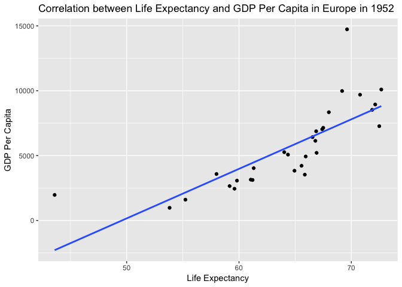
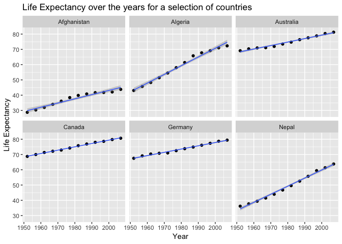
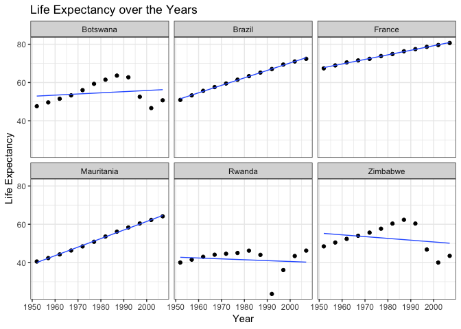
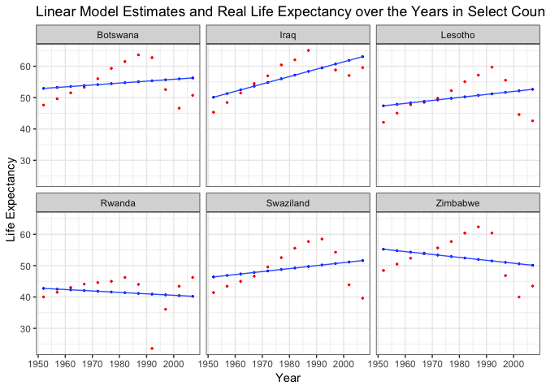
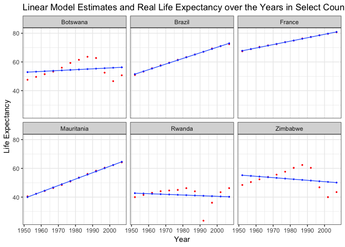
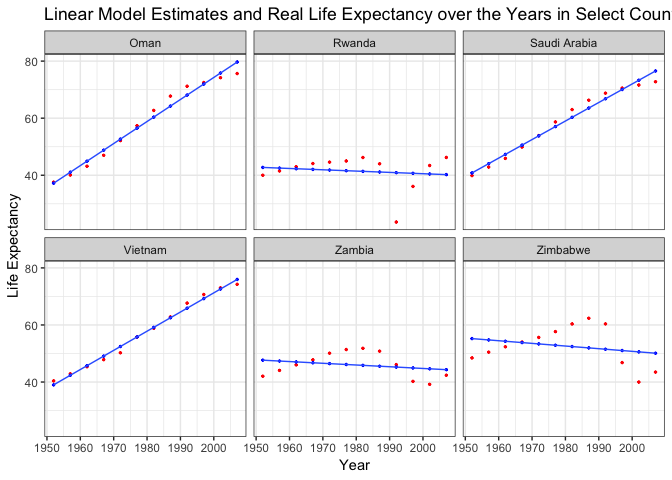

HW06-Data wrangling wrap up
================
Frederike Basedow
1 November 2018

Homework 06: Data wrangling wrap up
===================================

### Load packages

``` r
library(tidyverse)
```

    ## Warning: package 'ggplot2' was built under R version 3.4.4

``` r
library(gapminder)
library(knitr)
library(broom)
library(stringr)
library(singer)
library(ggmap)
library(repurrrsive)
library(readxl)
```

### Overview

Due November 09, 2018 at 23:59.

This is the *first* assignment of STAT 547M (despite it being named Homework 06).

Your task is to complete two of the six (numbered) topics below.

### 1. Character data

Read and work the exercises in the [Strings chapter](http://r4ds.had.co.nz/strings.html) or R for Data Science.

### 2. Writing functions

Pick one:

-   Write one (or more) functions that do something useful to pieces of the Gapminder or Singer data. It is logical to think about computing on the mini-data frames corresponding to the data for each specific country, location, year, band, album, ... This would pair well with the prompt below about working with a nested data frame, as you could apply your function there.
    -   Make it something you can't easily do with built-in functions. Make it something that's not trivial to do with the simple `dplyr` verbs. The linear regression function [presented here](http://stat545.com/block012_function-regress-lifeexp-on-year.html) is a good starting point. You could generalize that to do quadratic regression (include a squared term) or use robust regression, using `MASS::rlm()` or `robustbase::lmrob()`.

Let's make a function that fits a linear model between pop and gdpPercap for a specific continent in a specific year:

``` r
lm_lE_gdp <- function(cont, yr) {
  gap_select <- gapminder %>% filter(continent == cont, year == yr)
  lm(lifeExp ~ gdpPercap, data = gap_select)
}
```

Let's see if it works for Europe in 1952:

``` r
Eur_1952 <- lm_lE_gdp("Europe", "1952")
```

Let's get the r squared value to see if our model is a good fit, using the `glance` function from the `broom` package:

``` r
Eur_1952_glance <- glance(Eur_1952)

Eur_1952_glance$r.squared
```

    ## [1] 0.6084326

Not a super strong correlation between life expectancy and GDP per capita.

Let's also make a function for plotting it:

``` r
plot_lE_gdp_lm <- function(cont, yr){
  gapminder %>% 
  filter(continent == cont, year == yr) %>% 
  ggplot(aes(lifeExp, gdpPercap))+
  geom_point() +
  geom_smooth(method =lm, se=FALSE) +
  labs(title = str_c("Correlation between Life Expectancy and GDP Per Capita in ", cont, " in ", yr), x= "Life Expectancy", y = "GDP Per Capita")
}

plot_lE_gdp_lm("Europe", "1952")
```



### 4. Work with the `singer` data

I originally wanted to do this but am not able to get any locations. I am guessing that that is because I exceeded the max of 2500 queries a day since I didn't try on a smaller subset of data first (the data contains more than 2500 locations). I would still be interested to know if the code is correct. :)

The `singer_location` dataframe in the `singer` package contains geographical information stored in two different formats: 1. as a (dirty!) variable named `city`; 2. as a latitude / longitude pair (stored in `latitude`, `longitude` respectively). The function `revgeocode` from the `ggmap` library allows you to retrieve some information for a pair (vector) of longitude, latitude (warning: notice the order in which you need to pass lat and long). Read its manual page.

``` r
# have a look at data set
kable(head(singer_locations))
```

| track\_id          | title                 | song\_id           | release             | artist\_id         | artist\_name                   |  year|  duration|  artist\_hotttnesss|  artist\_familiarity|  latitude|  longitude| name          | city         |
|:-------------------|:----------------------|:-------------------|:--------------------|:-------------------|:-------------------------------|-----:|---------:|-------------------:|--------------------:|---------:|----------:|:--------------|:-------------|
| TRWICRA128F42368DB | The Conversation (Cd) | SOSURTI12A81C22FB8 | Even If It Kills Me | ARACDPV1187FB58DF4 | Motion City Soundtrack         |  2007|  170.4485|           0.6410183|            0.8230522|        NA|         NA| NA            | NA           |
| TRXJANY128F42246FC | Lonely Island         | SODESQP12A6D4F98EF | The Duke Of Earl    | ARYBUAO1187FB3F4EB | Gene Chandler                  |  2004|  106.5530|           0.3937627|            0.5700167|  41.88415|  -87.63241| Gene Chandler | Chicago, IL  |
| TRIKPCA128F424A553 | Here's That Rainy Day | SOQUYQD12A8C131619 | Imprompture         | AR4111G1187B9B58AB | Paul Horn                      |  1998|  527.5947|           0.4306226|            0.5039940|  40.71455|  -74.00712| Paul Horn     | New York, NY |
| TRYEATD128F92F87C9 | Rego Park Blues       | SOEZGRC12AB017F1AC | Still River         | ARQDZP31187B98D623 | Ronnie Earl & the Broadcasters |  1995|  695.1179|           0.3622792|            0.4773099|        NA|         NA| NA            | NA           |
| TRBYYXH128F4264585 | Games                 | SOPIOCP12A8C13A322 | Afro-Harping        | AR75GYU1187B9AE47A | Dorothy Ashby                  |  1968|  237.3220|           0.4107520|            0.5303468|  42.33168|  -83.04792| Dorothy Ashby | Detroit, MI  |
| TRKFFKR128F9303AE3 | More Pipes            | SOHQSPY12AB0181325 | Six Yanks           | ARCENE01187B9AF929 | Barleyjuice                    |  2006|  192.9400|           0.3762635|            0.5412950|  40.99471|  -77.60454| Barleyjuice   | Pennsylvania |

1.  Use `purrr` to map latitude and longitude into human readable information on the band's origin places. Notice that `revgeocode(... , output = "more")` outputs a dataframe, while `revgeocode(... , output = "address")` returns a string: you have the option of dealing with nested dataframes.
    You will need to pay attention to two things:
    -   Not all of the track have a latitude and longitude: what can we do with the missing information? (*filtering*, ...)
    -   Not all of the time we make a research through `revgeocode()` we get a result. What can we do to avoid those errors to bite us? (look at *possibly()* in `purrr`...)

First, I will make a tibble that includes the artist, the city and the longitude and latitude:

``` r
# select artist_name, latitude, longitude, and city
artist_location <- singer_locations %>% select(artist_name, latitude, longitude, city)

# check it out
kable(head(artist_location))
```

| artist\_name                   |  latitude|  longitude| city         |
|:-------------------------------|---------:|----------:|:-------------|
| Motion City Soundtrack         |        NA|         NA| NA           |
| Gene Chandler                  |  41.88415|  -87.63241| Chicago, IL  |
| Paul Horn                      |  40.71455|  -74.00712| New York, NY |
| Ronnie Earl & the Broadcasters |        NA|         NA| NA           |
| Dorothy Ashby                  |  42.33168|  -83.04792| Detroit, MI  |
| Barleyjuice                    |  40.99471|  -77.60454| Pennsylvania |

Let's get rid of all the artist of which there is no location noted:

``` r
#drop NAs
artist_location <- artist_location %>% drop_na

# print new tibble without NAs
kable(head(artist_location))
```

| artist\_name                                |  latitude|   longitude| city         |
|:--------------------------------------------|---------:|-----------:|:-------------|
| Gene Chandler                               |  41.88415|   -87.63241| Chicago, IL  |
| Paul Horn                                   |  40.71455|   -74.00712| New York, NY |
| Dorothy Ashby                               |  42.33168|   -83.04792| Detroit, MI  |
| Barleyjuice                                 |  40.99471|   -77.60454| Pennsylvania |
| Madlib                                      |  34.20034|  -119.18044| Oxnard, CA   |
| Seeed's Pharaoh Riddim Feat. General Degree |  50.73230|     7.10169| Bonn         |

``` r
get_location <- function(x, y) revgeocode(c(x,y), output = "address")

#map2(artist_location$longitude, artist_location$latitude, get_location)
```

1.  Try to check wether the place in `city` corresponds to the information you retrieved.

2.  If you still have time, you can go visual: give a look to the library [`leaflet`](https://rstudio.github.io/leaflet) and plot some information about the bands. A snippet of code is provided below.

<!-- -->

    singer_locations %>%  
      leaflet()  %>%   
      addTiles() %>%  
      addCircles(popup = ~artist_name)

### 5. Work with a list

Work through and write up a lesson from the [purrr tutorial](https://jennybc.github.io/purrr-tutorial/index.html):

-   [Trump Android Tweets](https://jennybc.github.io/purrr-tutorial/ls08_trump-tweets.html)

``` r
load("HW06-Data_wrangling_wrap_up_files/trump_tweets_df.rda")
```

``` r
tweets <- trump_tweets_df$text
head(tweets)
```

    ## [1] "My economic policy speech will be carried live at 12:15 P.M. Enjoy!"                                                                       
    ## [2] "Join me in Fayetteville, North Carolina tomorrow evening at 6pm. Tickets now available at: https://t.co/Z80d4MYIg8"                        
    ## [3] "#ICYMI: \"Will Media Apologize to Trump?\" https://t.co/ia7rKBmioA"                                                                        
    ## [4] "Michael Morell, the lightweight former Acting Director of C.I.A., and a man who has made serious bad calls, is a total Clinton flunky!"    
    ## [5] "The media is going crazy. They totally distort so many things on purpose. Crimea, nuclear, \"the baby\" and so much more. Very dishonest!" 
    ## [6] "I see where Mayor Stephanie Rawlings-Blake of Baltimore is pushing Crooked hard. Look at the job she has done in Baltimore. She is a joke!"

``` r
regex <- "badly|crazy|weak|spent|strong|dumb|joke|guns|funny|dead"
```

-   [Simplifying data from a list of GitHub users](https://jennybc.github.io/purrr-tutorial/ls02_map-extraction-advanced.html)

### 6. Work with a nested data frame

Create a nested data frame and map a function over the list column holding the nested data. Use list extraction or other functions to pull interesting information out of these results and work your way back to a simple data frame you can visualize and explore.

Here's a fully developed prompt for Gapminder:

-   See the [split-apply-combine lesson from Jenny Bryan](http://stat545.com/block024_group-nest-split-map.html)
-   Nest the data by country (and continent).

``` r
# nest gapminder data for each country
gap_nested <- gapminder %>% 
  group_by(continent, country) %>% 
  nest()

head(gap_nested)
```

    ## # A tibble: 6 x 3
    ##   continent country     data             
    ##   <fct>     <fct>       <list>           
    ## 1 Asia      Afghanistan <tibble [12 × 4]>
    ## 2 Europe    Albania     <tibble [12 × 4]>
    ## 3 Africa    Algeria     <tibble [12 × 4]>
    ## 4 Africa    Angola      <tibble [12 × 4]>
    ## 5 Americas  Argentina   <tibble [12 × 4]>
    ## 6 Oceania   Australia   <tibble [12 × 4]>

Now our data consists of one row for each country with a nested list for each country that contains all of the other data for this country in the data column. Let's have a look at what is in this list for the first country (Afghanistan):

``` r
# have a look at contents in data list of first country
kable(gap_nested$data[[1]], format = "html", caption = gap_nested$country[1])
```

<table>
<caption>
Afghanistan
</caption>
<thead>
<tr>
<th style="text-align:right;">
year
</th>
<th style="text-align:right;">
lifeExp
</th>
<th style="text-align:right;">
pop
</th>
<th style="text-align:right;">
gdpPercap
</th>
</tr>
</thead>
<tbody>
<tr>
<td style="text-align:right;">
1952
</td>
<td style="text-align:right;">
28.801
</td>
<td style="text-align:right;">
8425333
</td>
<td style="text-align:right;">
779.4453
</td>
</tr>
<tr>
<td style="text-align:right;">
1957
</td>
<td style="text-align:right;">
30.332
</td>
<td style="text-align:right;">
9240934
</td>
<td style="text-align:right;">
820.8530
</td>
</tr>
<tr>
<td style="text-align:right;">
1962
</td>
<td style="text-align:right;">
31.997
</td>
<td style="text-align:right;">
10267083
</td>
<td style="text-align:right;">
853.1007
</td>
</tr>
<tr>
<td style="text-align:right;">
1967
</td>
<td style="text-align:right;">
34.020
</td>
<td style="text-align:right;">
11537966
</td>
<td style="text-align:right;">
836.1971
</td>
</tr>
<tr>
<td style="text-align:right;">
1972
</td>
<td style="text-align:right;">
36.088
</td>
<td style="text-align:right;">
13079460
</td>
<td style="text-align:right;">
739.9811
</td>
</tr>
<tr>
<td style="text-align:right;">
1977
</td>
<td style="text-align:right;">
38.438
</td>
<td style="text-align:right;">
14880372
</td>
<td style="text-align:right;">
786.1134
</td>
</tr>
<tr>
<td style="text-align:right;">
1982
</td>
<td style="text-align:right;">
39.854
</td>
<td style="text-align:right;">
12881816
</td>
<td style="text-align:right;">
978.0114
</td>
</tr>
<tr>
<td style="text-align:right;">
1987
</td>
<td style="text-align:right;">
40.822
</td>
<td style="text-align:right;">
13867957
</td>
<td style="text-align:right;">
852.3959
</td>
</tr>
<tr>
<td style="text-align:right;">
1992
</td>
<td style="text-align:right;">
41.674
</td>
<td style="text-align:right;">
16317921
</td>
<td style="text-align:right;">
649.3414
</td>
</tr>
<tr>
<td style="text-align:right;">
1997
</td>
<td style="text-align:right;">
41.763
</td>
<td style="text-align:right;">
22227415
</td>
<td style="text-align:right;">
635.3414
</td>
</tr>
<tr>
<td style="text-align:right;">
2002
</td>
<td style="text-align:right;">
42.129
</td>
<td style="text-align:right;">
25268405
</td>
<td style="text-align:right;">
726.7341
</td>
</tr>
<tr>
<td style="text-align:right;">
2007
</td>
<td style="text-align:right;">
43.828
</td>
<td style="text-align:right;">
31889923
</td>
<td style="text-align:right;">
974.5803
</td>
</tr>
</tbody>
</table>
We can see that the list in the data column contains the year, life expectancy, population and GDP per capita information. This is the case for each country in the gap\_nested data.

Before fitting a model, let's quickly plot life expectancy over the years for a few random countries to get a feel for how the data looks like:

``` r
country_selection <- c("Afghanistan", "Germany", "Canada", "Nepal", "Algeria", "Australia")

gapminder %>% 
  filter(country %in% country_selection) %>% 
  ggplot(aes(year, lifeExp)) +
  geom_point()+
  geom_smooth(method = lm, size = 0.5) +
  facet_wrap(~country) +
  labs(title = "Life Expectancy over the years for a selection of countries", x = "Year", y = "Life Expectancy")
```



Cool, life expectancy seems to be linearly increasing over the years for all of these random countries. Let's fit a linear model to see if that is actually the case for all countries. Using the nested data frame `gap_nested` and the `map` function allows us to do that for all countries at the same time.

Reading through [this file from the STAT545 website](http://stat545.com/block012_function-regress-lifeexp-on-year.html), I learned that we need to specify the Intercept as the first year in the `gapminder` data, i.e. 1952 for the output to make sense.

Let's first make a function to fit the linear model that we can then use in `map` to apply it to all of our nested data.

``` r
fit_lEY <- function(data) lm(lifeExp ~ I(year - 1952), data = data)
```

We can easily use this function to fit a linear model for one country (e.g. Afghanistan) in our data:

``` r
# fitting our linear model for the first country in our data, i.e. Afghanistan
fit_lEY(gap_nested$data[[1]]) 
```

    ## 
    ## Call:
    ## lm(formula = lifeExp ~ I(year - 1952), data = data)
    ## 
    ## Coefficients:
    ##    (Intercept)  I(year - 1952)  
    ##        29.9073          0.2753

To fit it to all countries at the same time we can use the `map` function. I will store the output in a new list for each country under the new variable `fit` using the `mutate` function. .

``` r
gap_nested_fit <- gap_nested %>% 
  mutate(fit = map(data, fit_lEY))

head(gap_nested_fit)
```

    ## # A tibble: 6 x 4
    ##   continent country     data              fit     
    ##   <fct>     <fct>       <list>            <list>  
    ## 1 Asia      Afghanistan <tibble [12 × 4]> <S3: lm>
    ## 2 Europe    Albania     <tibble [12 × 4]> <S3: lm>
    ## 3 Africa    Algeria     <tibble [12 × 4]> <S3: lm>
    ## 4 Africa    Angola      <tibble [12 × 4]> <S3: lm>
    ## 5 Americas  Argentina   <tibble [12 × 4]> <S3: lm>
    ## 6 Oceania   Australia   <tibble [12 × 4]> <S3: lm>

Great, now we have a new column that includes info on the linear model. Let's have a looks at what's in there for the first 3 countries:

``` r
gap_nested_fit$fit[1:3]
```

    ## [[1]]
    ## 
    ## Call:
    ## lm(formula = lifeExp ~ I(year - 1952), data = data)
    ## 
    ## Coefficients:
    ##    (Intercept)  I(year - 1952)  
    ##        29.9073          0.2753  
    ## 
    ## 
    ## [[2]]
    ## 
    ## Call:
    ## lm(formula = lifeExp ~ I(year - 1952), data = data)
    ## 
    ## Coefficients:
    ##    (Intercept)  I(year - 1952)  
    ##        59.2291          0.3347  
    ## 
    ## 
    ## [[3]]
    ## 
    ## Call:
    ## lm(formula = lifeExp ~ I(year - 1952), data = data)
    ## 
    ## Coefficients:
    ##    (Intercept)  I(year - 1952)  
    ##        43.3750          0.5693

So we have the results from the linear model in each of these nested lists per country. We can extract more information about these results using the `broom` package. The `tidy` function from this package will give us the different parameters from a model nicely organized in a table. Here is how that looks like for the first country, i.e. Afghanistan:

-   Use functions for working with fitted models or the [broom package](https://github.com/tidyverse/broom) to get information out of your linear models.

``` r
# make function that applies broom function to the Afghanistan fit data and presents it in a kable
broom_apply_Afgh <- function(x) kable(x(gap_nested_fit$fit[[1]]))

# apply broom::tidy to linear model output data from Afghanistan
broom_apply_Afgh(tidy)
```

| term           |    estimate|  std.error|  statistic|  p.value|
|:---------------|-----------:|----------:|----------:|--------:|
| (Intercept)    |  29.9072949|  0.6639995|   45.04114|    0e+00|
| I(year - 1952) |   0.2753287|  0.0204509|   13.46289|    1e-07|

We can also look at fitted values and residuals for Afghanistan with the `augment` function from the `broom` package:

``` r
# apply broom::augment to linear model output data from Afghanistan
broom_apply_Afgh(augment)
```

|  lifeExp|  I.year...1952.|   .fitted|    .se.fit|      .resid|       .hat|    .sigma|    .cooksd|  .std.resid|
|--------:|---------------:|---------:|----------:|-----------:|----------:|---------:|----------:|-----------:|
|   28.801|               0|  29.90729|  0.6639995|  -1.1062949|  0.2948718|  1.211813|  0.2427205|  -1.0774216|
|   30.332|               5|  31.28394|  0.5799442|  -0.9519382|  0.2249417|  1.237512|  0.1134714|  -0.8842813|
|   31.997|              10|  32.66058|  0.5026799|  -0.6635816|  0.1689977|  1.265886|  0.0360357|  -0.5953084|
|   34.020|              15|  34.03722|  0.4358337|  -0.0172249|  0.1270396|  1.288917|  0.0000165|  -0.0150768|
|   36.088|              20|  35.41387|  0.3848726|   0.6741317|  0.0990676|  1.267003|  0.0185483|   0.5808279|
|   38.438|              25|  36.79051|  0.3566719|   1.6474883|  0.0850816|  1.154002|  0.0922536|   1.4085751|
|   39.854|              30|  38.16716|  0.3566719|   1.6868450|  0.0850816|  1.147076|  0.0967139|   1.4422244|
|   40.822|              35|  39.54380|  0.3848726|   1.2782016|  0.0990676|  1.208243|  0.0666828|   1.1012910|
|   41.674|              40|  40.92044|  0.4358337|   0.7535583|  0.1270396|  1.260583|  0.0316557|   0.6595814|
|   41.763|              45|  42.29709|  0.5026799|  -0.5340851|  0.1689977|  1.274051|  0.0233434|  -0.4791353|
|   42.129|              50|  43.67373|  0.5799442|  -1.5447284|  0.2249417|  1.148593|  0.2987950|  -1.4349402|
|   43.828|              55|  45.05037|  0.6639995|  -1.2223718|  0.2948718|  1.194109|  0.2963271|  -1.1904691|

And the `glance` function gives us a nice one-row summary. Here for Afghanistan:

``` r
# apply broom::glance to linear model output data from Afghanistan
broom_apply_Afgh(glance)
```

|  r.squared|  adj.r.squared|     sigma|  statistic|  p.value|   df|     logLik|       AIC|       BIC|  deviance|  df.residual|
|----------:|--------------:|---------:|----------:|--------:|----:|----------:|---------:|---------:|---------:|------------:|
|  0.9477123|      0.9424835|  1.222788|   181.2494|    1e-07|    2|  -18.34693|  42.69387|  44.14859|   14.9521|           10|

We can get this info for all countries at the same time using the `map` function again and create a a new variable again that contains a list for each country containing this data. Let's add the output of each of the 3 `broom` functions to each country as a separate list, in a new column each:

``` r
gap_nested_fit_data <- gap_nested_fit %>% 
  mutate(tidy = map(fit, tidy),
         augment = map( fit, augment),
         glance = map(fit, glance))

head(gap_nested_fit_data)
```

    ## # A tibble: 6 x 7
    ##   continent country     data              fit      tidy    augment glance 
    ##   <fct>     <fct>       <list>            <list>   <list>  <list>  <list> 
    ## 1 Asia      Afghanistan <tibble [12 × 4]> <S3: lm> <data.… <data.… <data.…
    ## 2 Europe    Albania     <tibble [12 × 4]> <S3: lm> <data.… <data.… <data.…
    ## 3 Africa    Algeria     <tibble [12 × 4]> <S3: lm> <data.… <data.… <data.…
    ## 4 Africa    Angola      <tibble [12 × 4]> <S3: lm> <data.… <data.… <data.…
    ## 5 Americas  Argentina   <tibble [12 × 4]> <S3: lm> <data.… <data.… <data.…
    ## 6 Oceania   Australia   <tibble [12 × 4]> <S3: lm> <data.… <data.… <data.…

Let's unnest these to create 3 different tibbles, one for each `broom` function output, so that we have this output for each country and can make use of it for further analysis.

Let's create a function for that:

``` r
gap_fit_unnest <- function(x) {
  gap_nested_fit_data %>% 
  select(continent, country, x) %>% 
  unnest()
}
```

First for the `tidy` output:

``` r
lEY_fit_tidy <- gap_fit_unnest("tidy") # unnest data from tidy list

kable(head(lEY_fit_tidy))
```

| continent | country     | term           |    estimate|  std.error|  statistic|  p.value|
|:----------|:------------|:---------------|-----------:|----------:|----------:|--------:|
| Asia      | Afghanistan | (Intercept)    |  29.9072949|  0.6639995|   45.04114|  0.0e+00|
| Asia      | Afghanistan | I(year - 1952) |   0.2753287|  0.0204509|   13.46289|  1.0e-07|
| Europe    | Albania     | (Intercept)    |  59.2291282|  1.0768440|   55.00251|  0.0e+00|
| Europe    | Albania     | I(year - 1952) |   0.3346832|  0.0331664|   10.09104|  1.5e-06|
| Africa    | Algeria     | (Intercept)    |  43.3749744|  0.7184202|   60.37549|  0.0e+00|
| Africa    | Algeria     | I(year - 1952) |   0.5692797|  0.0221271|   25.72775|  0.0e+00|

Next, for the `augment` output:

``` r
lEY_fit_augment <- gap_fit_unnest("augment") # unnest data from augment list

kable(head(lEY_fit_augment))
```

| continent | country     |  lifeExp|  I.year...1952.|   .fitted|    .se.fit|      .resid|       .hat|    .sigma|    .cooksd|  .std.resid|
|:----------|:------------|--------:|---------------:|---------:|----------:|-----------:|----------:|---------:|----------:|-----------:|
| Asia      | Afghanistan |   28.801|               0|  29.90729|  0.6639995|  -1.1062949|  0.2948718|  1.211813|  0.2427205|  -1.0774216|
| Asia      | Afghanistan |   30.332|               5|  31.28394|  0.5799442|  -0.9519382|  0.2249417|  1.237512|  0.1134714|  -0.8842813|
| Asia      | Afghanistan |   31.997|              10|  32.66058|  0.5026799|  -0.6635816|  0.1689977|  1.265886|  0.0360357|  -0.5953084|
| Asia      | Afghanistan |   34.020|              15|  34.03722|  0.4358337|  -0.0172249|  0.1270396|  1.288917|  0.0000165|  -0.0150768|
| Asia      | Afghanistan |   36.088|              20|  35.41387|  0.3848726|   0.6741317|  0.0990676|  1.267003|  0.0185483|   0.5808279|
| Asia      | Afghanistan |   38.438|              25|  36.79051|  0.3566719|   1.6474883|  0.0850816|  1.154002|  0.0922536|   1.4085751|

And lastly for the `glance` data:

``` r
lEY_fit_glance <- gap_fit_unnest("glance") # unnest data from glance list

kable(head(lEY_fit_glance))
```

| continent | country     |  r.squared|  adj.r.squared|      sigma|   statistic|  p.value|   df|      logLik|        AIC|        BIC|    deviance|  df.residual|
|:----------|:------------|----------:|--------------:|----------:|-----------:|--------:|----:|-----------:|----------:|----------:|-----------:|------------:|
| Asia      | Afghanistan |  0.9477123|      0.9424835|  1.2227880|   181.24941|  1.0e-07|    2|  -18.346935|  42.693870|  44.148590|  14.9521045|           10|
| Europe    | Albania     |  0.9105778|      0.9016355|  1.9830615|   101.82901|  1.5e-06|    2|  -24.149036|  54.298071|  55.752791|  39.3253302|           10|
| Africa    | Algeria     |  0.9851172|      0.9836289|  1.3230064|   661.91709|  0.0e+00|    2|  -19.292214|  44.584427|  46.039147|  17.5034589|           10|
| Africa    | Angola      |  0.8878146|      0.8765961|  1.4070091|    79.13818|  4.6e-06|    2|  -20.030928|  46.061857|  47.516577|  19.7967471|           10|
| Americas  | Argentina   |  0.9955681|      0.9951249|  0.2923072|  2246.36635|  0.0e+00|    2|   -1.173933|   8.347866|   9.802586|   0.8544349|           10|
| Oceania   | Australia   |  0.9796477|      0.9776125|  0.6206086|   481.34586|  0.0e+00|    2|  -10.208677|  26.417353|  27.872073|   3.8515501|           10|

Great, now we have 3 different tibbles with information from the linear model for every country.

-   Use the usual dplyr, tidyr, and ggplot2 workflows to explore, e.g., the estimated cofficients.

Let's use the `lEY_fit_augment` data to make a plot that shows the estimated and the real life Exp to visualize the residuals. Let's do it for the same countries as plotted above:

``` r
# select relevant columns
gap_year_data <- gapminder %>% 
  select(country, lifeExp, year)

lEY_fit_augment <- left_join(lEY_fit_augment, gap_year_data)

head(lEY_fit_augment)
```

    ## # A tibble: 6 x 12
    ##   continent country  lifeExp I.year...1952. .fitted .se.fit  .resid   .hat
    ##   <fct>     <fct>      <dbl>          <dbl>   <dbl>   <dbl>   <dbl>  <dbl>
    ## 1 Asia      Afghani…    28.8             0.    29.9   0.664 -1.11   0.295 
    ## 2 Asia      Afghani…    30.3             5.    31.3   0.580 -0.952  0.225 
    ## 3 Asia      Afghani…    32.0            10.    32.7   0.503 -0.664  0.169 
    ## 4 Asia      Afghani…    34.0            15.    34.0   0.436 -0.0172 0.127 
    ## 5 Asia      Afghani…    36.1            20.    35.4   0.385  0.674  0.0991
    ## 6 Asia      Afghani…    38.4            25.    36.8   0.357  1.65   0.0851
    ## # ... with 4 more variables: .sigma <dbl>, .cooksd <dbl>,
    ## #   .std.resid <dbl>, year <int>

``` r
# make a function for plotting this:
plot_lEY <- function(data, selection) {
data %>% 
  filter(country %in% selection) %>% 
  ggplot() +
  geom_point(aes(year, lifeExp), size = 0.5, colour = "red") +
  geom_point(aes(year, .fitted), size = 0.5, colour = "blue") +
  geom_smooth(aes(year, .fitted), size = 0.5, se = FALSE) +
  facet_wrap(~country) +
    theme_bw() +
    labs(title = "Linear Model Estimates and Real Life Expectancy over the Years in Select Countries", 
         x= "Year", 
         y = "Life Expectancy") 
}

plot_lEY(lEY_fit_augment, country_selection) # plot randomly selected countries from above
```

    ## `geom_smooth()` using method = 'loess' and formula 'y ~ x'



We can see that the residuals are really close to the estimated life expectancies from our model. Let's see if we can find the country with the biggest residuals:

``` r
lEY_max_res <- lEY_fit_augment %>% 
  group_by(country) %>% 
  summarize(max_res = max(.resid)) %>% 
  arrange(desc(max_res)) 

kable(head(lEY_max_res))
```

| country   |   max\_res|
|:----------|----------:|
| Zimbabwe  |  10.385491|
| Botswana  |   8.569486|
| Lesotho   |   8.483345|
| Swaziland |   8.283148|
| Iraq      |   6.698171|
| Rwanda    |   6.020782|

Cool, let's plot the 6 countries with the highest residuals:

``` r
# reorder levels by descending max residual
lEY_max_res <- lEY_max_res %>%
  mutate(country = fct_reorder(country, max_res, desc))

# extract 6 countries with highest residuals
lEY_max_res_countries <- levels(lEY_max_res$country)[1:6]

# plot estimated and real life expectancy for these countries
plot_lEY(lEY_fit_augment, lEY_max_res_countries)
```

    ## `geom_smooth()` using method = 'loess' and formula 'y ~ x'



We can see that the linear model is not a great fit in these countries.

We can also use the rsquared value from the `glance` data to find the countries in which the models fit best, or worst:

``` r
lEY_max_r2 <- lEY_fit_glance %>% 
  select(country, r.squared) %>% 
  arrange(desc(r.squared)) %>% 
  mutate(country = fct_reorder(country, r.squared, desc))

kable(head(lEY_max_r2))
```

| country     |  r.squared|
|:------------|----------:|
| Brazil      |  0.9980474|
| Mauritania  |  0.9976743|
| France      |  0.9976246|
| Switzerland |  0.9973909|
| Pakistan    |  0.9972497|
| Indonesia   |  0.9971142|

``` r
# make function to extract the first 3 and last 3 countries
get_countries <- function(data) {
  c(levels(data$country)[1:3], 
    levels(data$country)[(nlevels(data$country)-2):nlevels(data$country)])
}

lEY_max_r2_countries <- get_countries(lEY_max_r2)
```

Let's plot these:

``` r
plot_lEY(lEY_fit_augment, lEY_max_r2_countries)
```

    ## `geom_smooth()` using method = 'loess' and formula 'y ~ x'



Let's see if we can find the countries with the steepest increase in lifeExp over the years. First I'll make the tidy data easier to work with.

And as in Jenny Bryan's tutorial, let's recode the term variable in the tidy data frame so that it is easier to work with it:

``` r
lEY_fit_tidy <- lEY_fit_tidy %>% 
  mutate(term = recode(term,
                        `(Intercept)` = "intercept",
                        `I(year - 1952)` = "slope"))

kable(head(lEY_fit_tidy))
```

| continent | country     | term      |    estimate|  std.error|  statistic|  p.value|
|:----------|:------------|:----------|-----------:|----------:|----------:|--------:|
| Asia      | Afghanistan | intercept |  29.9072949|  0.6639995|   45.04114|  0.0e+00|
| Asia      | Afghanistan | slope     |   0.2753287|  0.0204509|   13.46289|  1.0e-07|
| Europe    | Albania     | intercept |  59.2291282|  1.0768440|   55.00251|  0.0e+00|
| Europe    | Albania     | slope     |   0.3346832|  0.0331664|   10.09104|  1.5e-06|
| Africa    | Algeria     | intercept |  43.3749744|  0.7184202|   60.37549|  0.0e+00|
| Africa    | Algeria     | slope     |   0.5692797|  0.0221271|   25.72775|  0.0e+00|

Next, I'll make it an "untidy" data frame, with estimates for intercept and slope as their own columns and arrange by slope and reorder factor levels accordingly:

``` r
lEY_max_slope <- fit_tidy_spread <- lEY_fit_tidy %>% 
  select(continent:estimate) %>% 
  spread(key = term, value = estimate) %>% 
  arrange(desc(slope)) %>% 
  mutate(country = fct_reorder(country, slope, desc))

kable(head(lEY_max_slope))
```

| continent | country      |  intercept|      slope|
|:----------|:-------------|----------:|----------:|
| Asia      | Oman         |   37.20774|  0.7721790|
| Asia      | Vietnam      |   39.01008|  0.6716154|
| Asia      | Saudi Arabia |   40.81412|  0.6496231|
| Asia      | Indonesia    |   36.88312|  0.6346413|
| Africa    | Libya        |   42.10194|  0.6255357|
| Asia      | Yemen, Rep.  |   30.13028|  0.6054594|

Let's extract the 3 countries with steepest slope and the 3 countries with the lowest slope and plot them:

``` r
# extract 3 countries with highest and 3 countries with lowest slope
lEY_max_slope_countries <- get_countries(lEY_max_slope)

# plot estimated and real life expectancy for these countries
plot_lEY(lEY_fit_augment, lEY_max_slope_countries)
```

    ## `geom_smooth()` using method = 'loess' and formula 'y ~ x'



Inspiration for the modelling and downstream inspiration

-   Find countries with interesting stories. - Sudden, substantial departures from the temporal trend is interesting. How could you operationalize this notion of "interesting"?
-   Use the residuals to detect countries where your model is a terrible fit. Examples: Are there are 1 or more freakishly large residuals, in an absolute sense or relative to some estimate of background variability? Are there strong patterns in the sign of the residuals? E.g., all pos, then all neg, then pos again.
-   Fit a regression using ordinary least squares and a robust technique. Determine the difference in estimated parameters under the two approaches. If it is large, consider that country "interesting".
-   Compare a linear and quadratic fit
